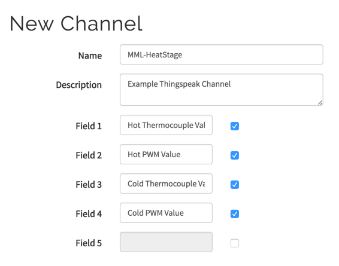
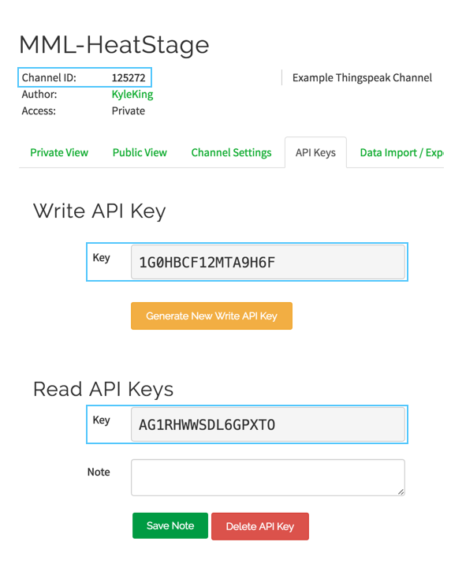
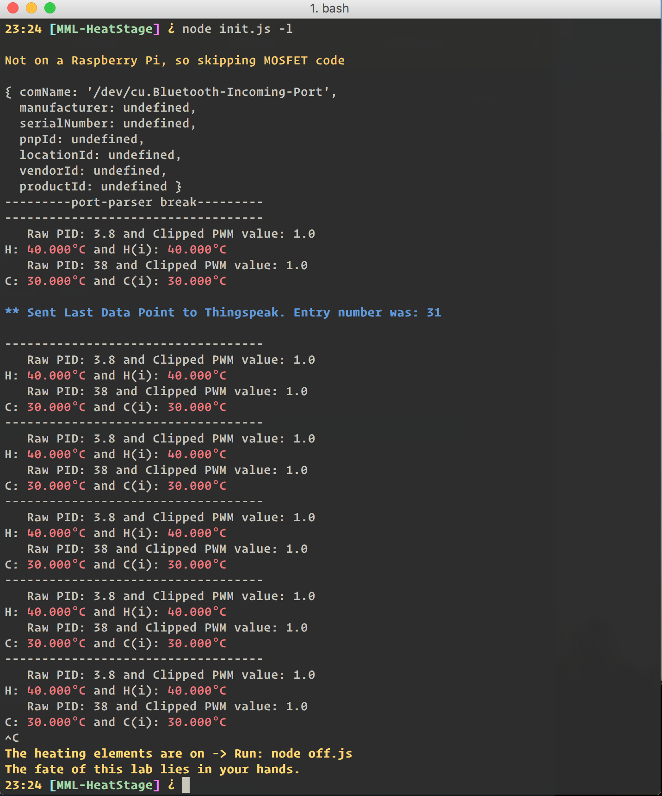
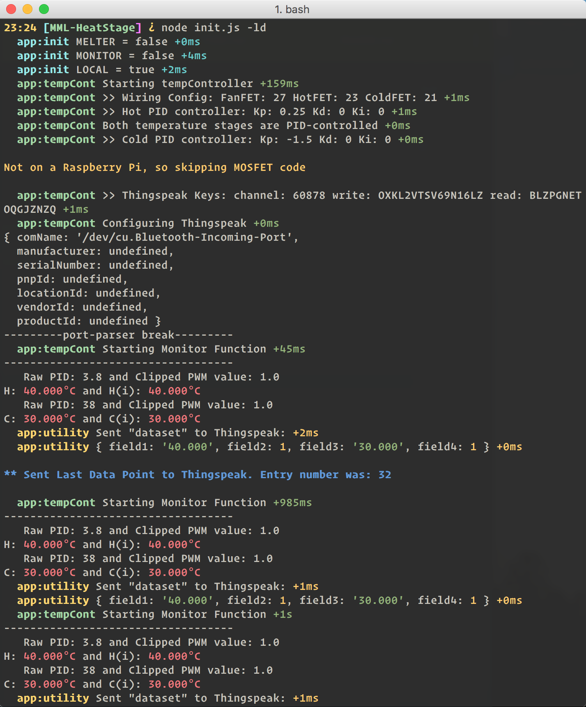
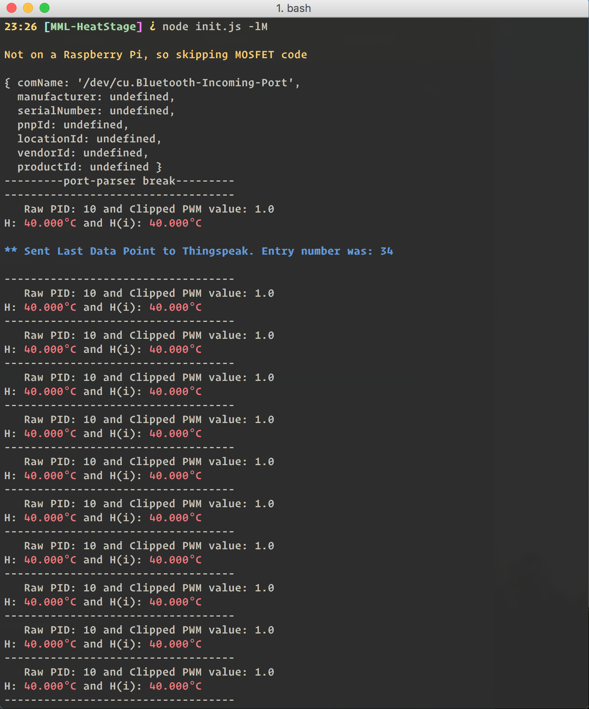

# MML-HeatStage
Maryland MEMS and Microfluidics Laboratory Node Application to control a dual-heat stage among other things

## Quick Start

Download a ready to go Jessie img with the Turtlebot controller and other installed software: [https://dl.dropboxusercontent.com/u/34498281/RPI_Complete_Heat_Stage_Controller.img.zip](https://dl.dropboxusercontent.com/u/34498281/RPI_Complete_Heat_Stage_Controller.img.zip). Once downloaded, unzip the folder and open a terminal session to enter these commands:

1. Get the microSD disk number and unmount the specified disk (in this case, /dev/disk2)

    ```sh
    diskutil list | grep 0: # then match up the disk name and disk ID
    diskutil unmountDisk /dev/disk2 # or disk3, etc.
    ```

2. See the notes prepended by `#`. Make sure to update the file name and disk ID appropriately. To check the current status, while writing to the SD card press <kbd>Ctrl</kbd>+<kbd>T</kbd> (on Mac).

    ```sh
    # Navigate to your downloads folder
    cd ~/Downloads
    # Unzip the newly downloaded file
    unzip RPI_Complete_Heat_Stage_Controller.img.zip
    # Write the unzipped file to your card
    sudo dd bs=1m if=RPI_Complete_Heat_Stage_Controller.img of=/dev/rdisk2
    ```

3. After a short wait, the SD card will be ready to go. Plug the microSD card into the Raspberry Pi and connect the USB Devices/HDMI/Ethernet cord with the micro USB power supply last. You should the green light blink to confirm the SD card is booting. The green light will stop when completed booting.

Now skip to "Booting a Fresh Installation" and skip the installation steps (that has already been done for you!)

## *(Alternatively) Starting from Scratch*

First, you'll want a clean installation of Jessie on a SD card 4gb or greater (8 gb preferable)

### Format a fresh microSD Card

Using a microSD adapter, erase the microSD card to the `MS-DOS (FAT)` format. On a Mac this can be done through the Disk Utility application.

### Download `Raspbian-Jessie`

Download the [latest distribution hosted by the Raspberry Pi foundation](https://www.raspberrypi.org/downloads/raspbian/). The `.img` file is about 1.5 gb, so it will take some time to download. To make the SD card bootable by the Raspberry Pi, you will need to open Terminal on Linux/Mac or gnome-terminal for PC. For the most part you can copy and paste these commands, but make sure to read them first.

1. Get the microSD disk number and unmount the specified disk (in this case, /dev/disk2)

    ```sh
    diskutil list | grep 0: # then match up the disk name and disk ID
    diskutil unmountDisk /dev/disk2
    ```

2. See the notes prepended by `#`. Make sure to update the file name and disk ID appropriately. To check the current status, while writing to the SD card press <kbd>Ctrl</kbd>+<kbd>T</kbd> (on Mac).

    ```sh
    # Navigate to your downloads folder
    cd ~/Downloads
    # Unzip the newly downloaded file
    unzip 2016-05-27-raspbian-jessie.zip
    # Write the unzipped file to your card
    sudo dd bs=1m if=2016-05-27-raspbian-jessie.img of=/dev/rdisk2
    ```

3. For additional assistance, see the [Raspberry Pi official guide](http://raspberrypi.stackexchange.com/a/313)

4. After a short wait, the SD card will be ready to go. Plug the microSD card into the Raspberry Pi and connect the USB Devices/HDMI/Ethernet cord with the micro USB power supply last. You should the green light blink to confirm the SD card is booting. The green light will stop when completed booting.


## Booting a Fresh Installation

### Fast Setup

The lab has HDMI-VGA adapters and several VGA displays, along with mice and keyboards. Grab one of each and connect them to the Raspberry Pi. When powered on you can interact with the Pi as if a full size computer.

### *(Alternatively) Headless Connection*

On a Mac:

* Connect to a wifi network that allows internet sharing (anything but UMD-Secure or Eduroam)
* Open System Preferences -> Network and make sure there is a profile for an Ethernet connection and a Wifi profile
* The wifi connection should be first and Ethernet second (you can change this by clicking on the cog wheel (bottom of window) > set service order)
* Navigate to the sharing profile and turn on Wifi > Ethernet internet sharing
* Connect the Raspberry Pi, then power it on
* Find the IP address and SSH into the pi (see instructions below)

You will need nmap, which can be [downloaded here](https://nmap.org/download.html#macosx). It looks sketchy, but the site is legit. Look for the `
Latest release installer: nmap-7.12.dmg` link (for Mac). There are also options for PC's as well.

Using nmap, find the raspberry pi's IP address ([Source](http://raspberrypi.stackexchange.com/questions/13936/find-raspberry-pi-address-on-local-network/13937#13937)):

```sh
nmap -p 22 --open -sV 192.168.2.*
# Alternatively:
sudo nmap -sP 192.168.2.* | awk '/^Nmap/{ip=$NF}/B8:27:EB/{print ip}'

# If using a Wifi adapter, there is a slight variation:
sudo nmap -sP 192.168.1.*
```

Now connect to the Raspberry Pi. The initial password is `raspberry`, while the user is pi.

```sh
# Use the address returned by the previous command
ssh pi@192.168.2.8
```

#### Troubleshooting SSH

If having trouble with “man in the middle” warnings, regenerate the SSH key:

```sh
ssh-keygen -R # "<enter hostname>”
# For example:
ssh-keygen -R 192.168.2.9
```

### Configure the Raspberry Pi

The initial password is `raspberry`. Once logged in you will need to run:

```sh
sudo raspi-config
```

Click through the menu options using your arrow keys. You will want to make sure to:

* Expand the file system
* Change password
* Set locale (Internationalisation Options -> Change Locale ->  en_GB.UTF-8 -> then set again as default)
* and any other options you see fit
* Reboot, especially if you changed the filesystem

## Specifics for this Application

### Installation

You will need to install a few prerequisites to get started.

```sh
# Download the node installer:
wget https://nodejs.org/dist/v4.0.0/node-v4.0.0-linux-armv7l.tar.gz
tar -xvf node-v4.0.0-linux-armv7l.tar.gz
cd node-v4.0.0-linux-armv7l

# Download a python library for thermocouples
# Adafruit_Python_MAX31855: https://github.com/adafruit/Adafruit_Python_MAX31855
cd ~
sudo apt-get install build-essential python-dev python-smbus -y
git clone https://github.com/adafruit/Adafruit_Python_MAX31855.git
cd Adafruit_Python_MAX31855
sudo python setup.py install

# Download the library for PWM control
# Pi-Blaster: https://github.com/sarfata/pi-blaster
sudo apt-get install autoconf -y
cd ~
git clone https://github.com/sarfata/pi-blaster.git
cd ~/pi-blaster/
./autogen.sh; ./configure && make
```

Check the newly installed libraries

```sh
node -v
# it should return: v4.0.0

# Test the Thermocouple libraries:
python ~/MML-HeatStage/Scripts_Python/read_Thermocouples.py
# This should print out something like this:
# 24.250, 24.562, 23.000, 23.750
# 24.250, 24.562, 23.000, 23.750
# etc.

# Test the Pi-Blaster for MOSFET Control:
bash ~/MML-HeatStage/Scripts_Shell/start_Pi-Blaster.sh
echo "21=1" > /dev/pi-blaster
sleep 3
echo "21=.2" > /dev/pi-blaster
sleep 3
echo "21=0.5" > /dev/pi-blaster
sleep 3
echo "21=0" > /dev/pi-blaster
# The LED of the Left MOSFET should change in brightness
```

Install the other files for the Node Application:

```sh
# Download Kyle's Node Application:
cd ~
git clone https://github.com/KyleKing/MML-HeatStage.git
cd ~/MML-HeatStage/
npm install
# this may take ~15 minutes
```

To make sure everything is up to date, make sure to run this file. Although you don't need to run it right now:

```sh
cd ~/MML-HeatStage/Scripts_Shell/
bash update.sh
```

### Configure Thingspeak

You will need to create an account and grab a couple of authentication keys:

1. [Create an account here](https://thingspeak.com/users/sign_up)

    <p align="center">
        
    </p>

	<!--  -->

2. Get the necessary details (see annotated screenshot below)

    <p align="center">
        
    </p>

	<!--  -->

3. Run a few more command line commands:

	```sh
	cd ~/MML-HeatStage/
	# Make a new file:
	touch thingspeakkey.json
	# Edit the file:
	nano thingspeakkey.json
	```

	Edit these numbers to match your specific Thingspeak account and paste the edited text into the open file editor:

	```json
	{
		"channel": 125272,
		"write": "1G0HBCF12MTA9H6F",
		"read": "AG1RWWSDL6GPXTO"
	}
	```

## First Use

Run:

```sh
cd ~/MML-HeatStage
node init.js -l
```

and you should see something like this (note: press <kbd>Ctrl</kbd>+<kbd>C</kbd> to quit):

<p align="center">
    
</p>

<!--  -->

The displays shows `H` - the designated hot thermocouple temperature and the internal breakout board temperature `H(i)` as a control value. Above this line is the raw PID output. The first value is calculated by the PID controller and the second is the clipped version, which is the state of the MOSFET controller, which ranges from 0 - 1. Due to rate limiting of the Thingspeak API, you will intermittently get an update when the Thingspeak chart has been updated.

If you wish to see greater details and other debugging information, use this command: `node init.js -ld`

<p align="center">
    
</p>

<!--  -->

In the past two examples you've already used options flags, which are interpreted by the Node application. Like this (you can get this output by running `node init.js --help`:

```sh
Usage: init [options]

Options:

	-h, --help     output usage information
	-V, --version  output the version number
	-M, --melter   single heat stage melter version
	-m, --monitor  shut down peltier elements and monitor temperature
	-d, --debug    run in debug mode (verbose)
	-l, --local    when not a Raspberry Pi, run in 'local' mode
```

We have been using the `--local` or `-l` flag, which lets the code know that you don't have the proper electrical circuits configured. This is great for testing the code and to make sure the software works as expected. To actually run the device and use the thermocouple feedback and PID control, you don't need any flags, simply run `node init.js`.

On a quick side note, for melting the agarose bead bed, use `node init.js -melter` or `node init.js -M`, which runs only one thermocouple/Peltier tile.

<p align="center">
    
</p>

<!--  -->

## Putting Everything Together (Electronics)

You will need to edit the `settings.json` file to some extent.

TODO:

- settings
- wiring diagrams (what app?) and check pin numbering
- show pictures of setup


## Next Steps

The code base currently supports controlling syringe pumps and the pi camera, but I ran out of time to finish the implementation and the user interface. If you would like to continue developing the code base the functionality is there.

To see the literature review, early results, posters, other documentation, and ideas for future directions of this research, refer to the mantis issue here:
